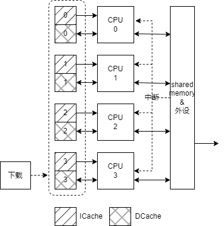

# 基于RISC-V的多核心MCU设计与实现

暂定目标包括：
1. 功能级的模拟器。从指令级模拟多核心RISCV MCU，暂定4核心，用RUST语言编写。支持RISC-V的gdb调试。
1. FPGA仿真。实现4个RISC-V核心，暂定单周期，无流水线；中断系统，每个核心均可以处理中断；简单外设，等等
1. 例子程序。运行在RISC-V上的例子程序，包括多核心间的通信等。包括基于RISC-V GNU开源编译器的Makefile编写。

github链接：[https://github.com/chenpeijun256/multi_core_riscv](https://github.com/chenpeijun256/multi_core_riscv)